# 🏠 Airbnb Data Engineering Dashboard

An end-to-end **Data Engineering & Analytics** project built using **Python, DuckDB, SQL, Streamlit, Plotly, and Statistical Analysis** to transform Airbnb listing data into meaningful business insights through an interactive dashboard.

---

# 📌 Project Overview

This project was developed as part of the **Expernetic Data Engineer Internship Assessment**.

The project demonstrates a complete data engineering workflow, including:

- Data ingestion
- Data cleaning
- Feature engineering
- SQL analytics using DuckDB
- Star schema data modeling
- Exploratory Data Analysis (EDA)
- Statistical hypothesis testing
- Interactive dashboard development
- Automated PDF report generation

The dashboard enables users to explore Singapore Airbnb listings, analyze pricing trends, compare neighbourhood performance, and generate business insights interactively.

---

## System Architecture

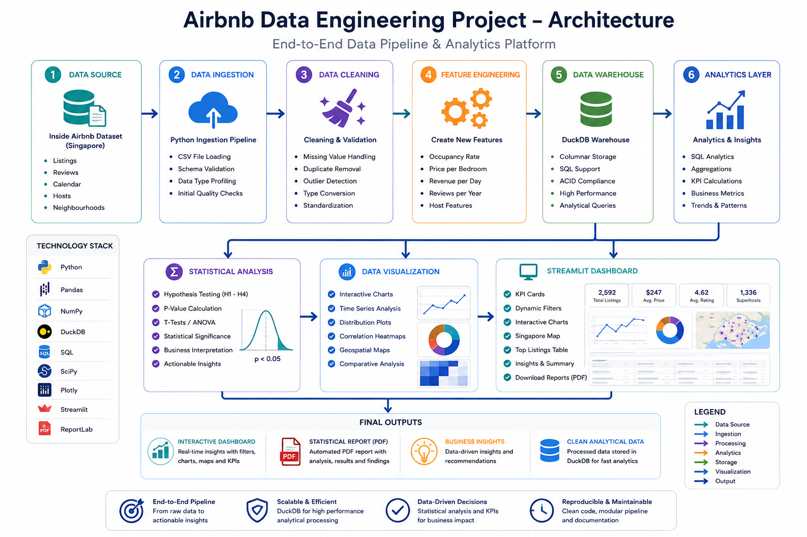

---

# 🚀 Features

### Data Engineering

- Data Ingestion Pipeline
- Data Cleaning & Validation
- Feature Engineering
- DuckDB Database Integration
- Star Schema Implementation

### Analytics

- SQL Queries
- Business KPI Analysis
- Exploratory Data Analysis
- Statistical Hypothesis Testing

### Dashboard

- Interactive KPI Cards
- Dynamic Filters
- Interactive Charts
- Singapore Map Visualization
- Premium Listings Table
- Statistical Results
- About Page
- PDF Report Generation

---

# 📊 Dashboard Preview

## 🏠 Dashboard

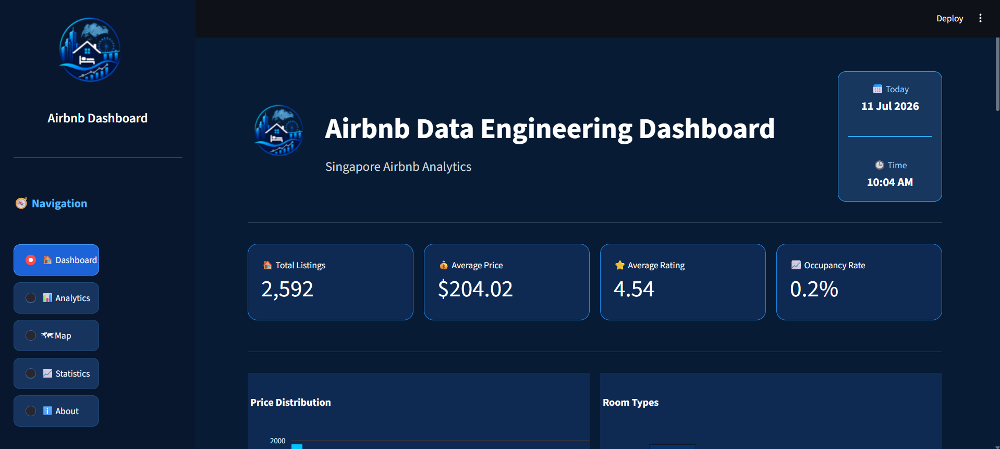
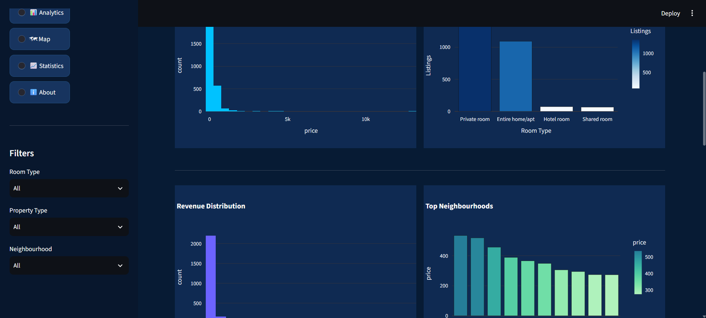

---

## 📈 Analytics

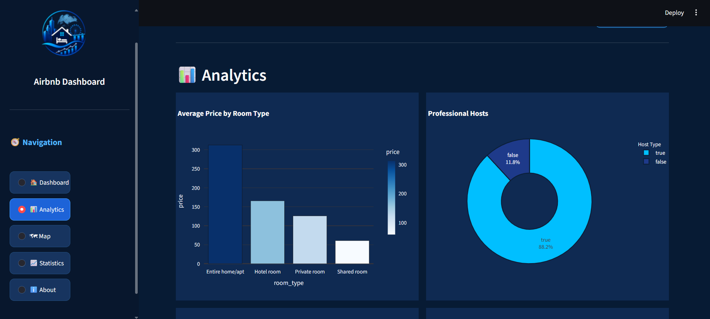
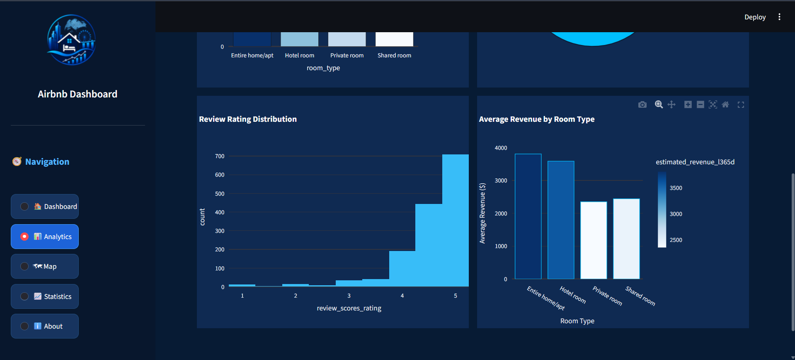

---

## 🗺 Singapore Map

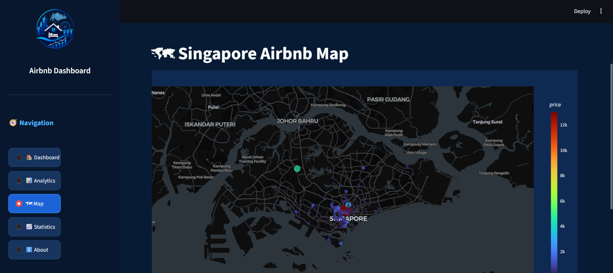

---

## 📊 Statistical Analysis

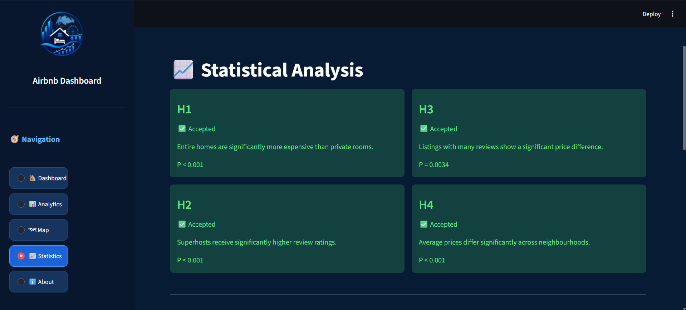
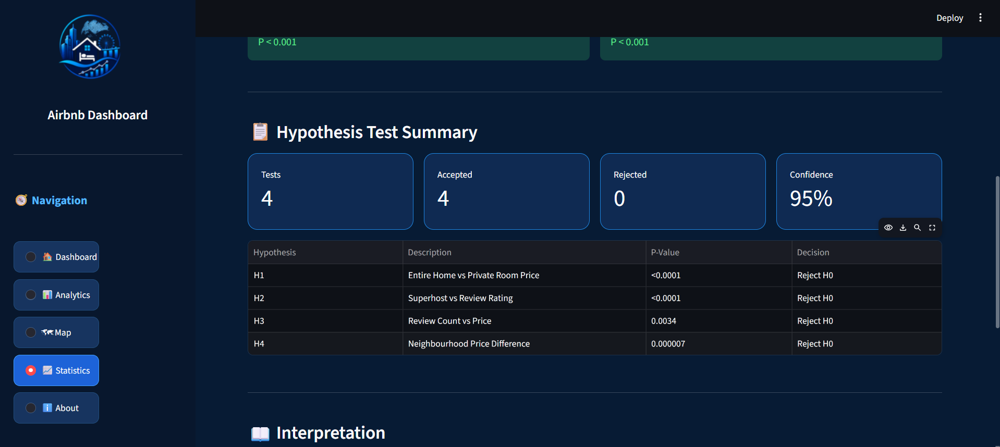
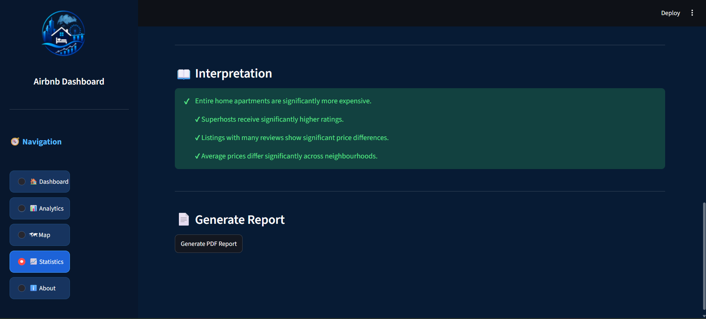

---

## ℹ About Page

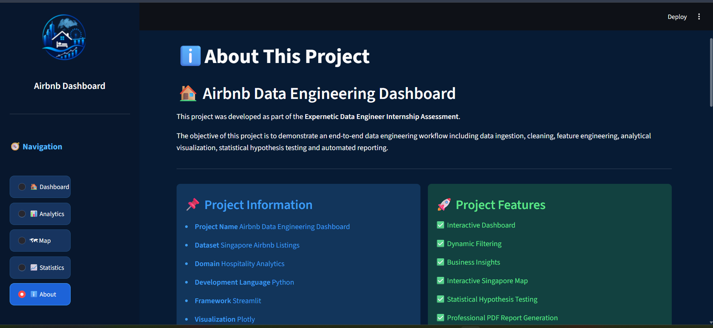
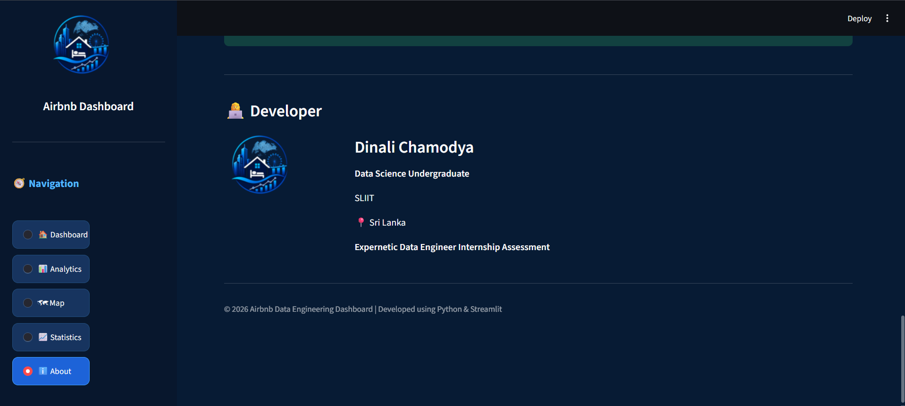

---

# 🏗 Data Engineering Pipeline

```
                   Airbnb Dataset
                          │
                          ▼
                 Data Ingestion Pipeline
                          │
                          ▼
                   Data Cleaning
                          │
                          ▼
                 Feature Engineering
                          │
                          ▼
                    DuckDB Database
                          │
        ┌─────────────────┼─────────────────┐
        ▼                 ▼                 ▼
   SQL Analytics     Statistical Tests    Dashboard
                                                │
                                                ▼
                                          PDF Report
```

---

# 📂 Project Structure

```
airbnb-data-engineering/

│

├── assets/
│   └── logo.png
│
├── dashboard/
│   ├── app.py
│   ├── charts.py
│   ├── report.py
│   └── styles.css
│
├── data/
│   ├── raw/
│   └── processed/
│
├── screenshots/
│   ├── dashboard.png
│   ├── analytics.png
│   ├── map.png
│   ├── statistics.png
│   └── about.png
│
├── sql/
│   ├── create_tables.sql
│   ├── star_schema.sql
│   ├── load_data.sql
│   └── analysis_queries.sql
│
├── src/
│   ├── ingest.py
│   ├── clean.py
│   ├── transform.py
│   ├── create_database.py
│   ├── build_star_schema.py
│   ├── run_queries.py
│   ├── statistics.py
│   └── eda.py
│
├── reports/
│
├── run_pipeline.py
│
├── requirements.txt
│
├── README.md
│
└── LICENSE
```

---

# 🛠 Technology Stack

| Category | Technologies |
|----------|--------------|
| Programming | Python |
| Database | DuckDB |
| Data Processing | Pandas, NumPy |
| Dashboard | Streamlit |
| Visualization | Plotly |
| Statistical Analysis | SciPy |
| PDF Reporting | ReportLab |
| SQL | DuckDB SQL |

---

# 📂 Dataset

**Dataset Source**

Inside Airbnb

https://insideairbnb.com/

The dataset contains:

- Listing Information
- Property Types
- Room Types
- Pricing
- Availability
- Review Scores
- Host Information
- Geographic Coordinates

---

# 🧹 Data Cleaning

The following preprocessing steps were performed:

- Removed duplicate records
- Removed completely empty columns
- Removed listings with missing prices
- Cleaned currency values
- Converted data types
- Validated missing values
- Prepared dataset for feature engineering

Final Dataset

- Original Records : **3097**
- Clean Records : **2592**

---

# ⚙ Feature Engineering

The following engineered features were created:

- Price per Bedroom
- Occupancy Rate
- Revenue per Available Day
- Reviews per Year
- Professional Host Indicator

---

# 🗄 Database Design

DuckDB was used as the analytical database.

The following tables were created:

### Fact Table

- fact_listings

### Dimension Tables

- dim_host
- dim_location
- dim_review

A Star Schema was implemented for analytical querying.

### Star Schema

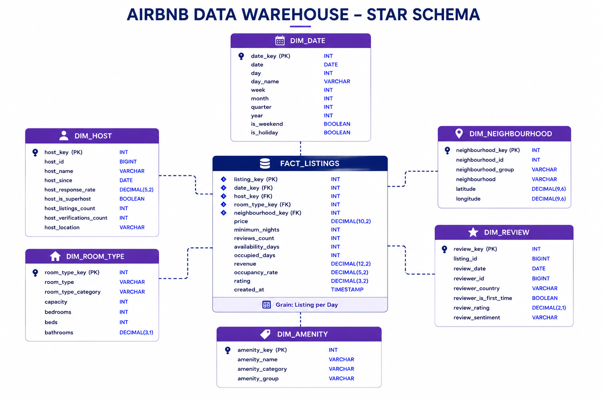

---

# 📈 SQL Analytics

Several business queries were implemented, including:

- Total Listings
- Average Price
- Room Type Distribution
- Highest Revenue Listings
- Superhost Analysis
- Average Price by Neighbourhood
- Property Type Analysis
- Review Score Analysis

---

# 📊 Statistical Analysis

Four hypotheses were tested.

| Hypothesis | Result |
|------------|---------|
| H1 | ✅ Accepted |
| H2 | ✅ Accepted |
| H3 | ✅ Accepted |
| H4 | ✅ Accepted |

### H1

Entire home apartments are significantly more expensive than private rooms.

### H2

Superhosts receive significantly higher review ratings.

### H3

Listings with more reviews show statistically significant price differences.

### H4

Average prices differ significantly across neighbourhoods.

---

# 💡 Business Insights

Key findings include:

- Entire home apartments command the highest average prices.
- Superhosts consistently receive higher customer ratings.
- Premium neighbourhoods generate higher average revenue.
- Property location strongly influences pricing.
- Listings with strong customer engagement tend to perform better.

---

# 📄 PDF Report

The dashboard supports automatic generation of a professional PDF report containing:

- Dashboard Summary
- KPI Metrics
- Statistical Analysis
- Business Insights
- Final Conclusions

---

# ▶ Running the Project

Clone the repository

```bash
git clone https://github.com/Dinaz-12/Airbnb-Data-Engineering.git
```

Navigate into the project

```bash
cd airbnb-data-engineering
```

Install dependencies

```bash
pip install -r requirements.txt
```

Run the complete pipeline

```bash
python run_pipeline.py
```

Launch the dashboard

```bash
streamlit run dashboard/app.py
```

---

# 📋 Requirements

Install all required packages

```bash
pip install -r requirements.txt
```

---

# 🔮 Future Improvements

Future enhancements may include:

- Machine Learning Price Prediction
- Recommendation System
- Time-Series Forecasting
- Cloud Deployment
- Docker Containerization
- CI/CD Pipeline
- Real-time Data Integration

---

# 👩‍💻 Author

**Dinali Chamodya**

Data Science Undergraduate

Sri Lanka Institute of Information Technology (SLIIT)

Expernetic Data Engineer Internship Assessment

---

# 📜 License

This project is developed for educational and internship assessment purposes.

Licensed under the MIT License.

---

⭐ If you found this project interesting, consider giving it a star.